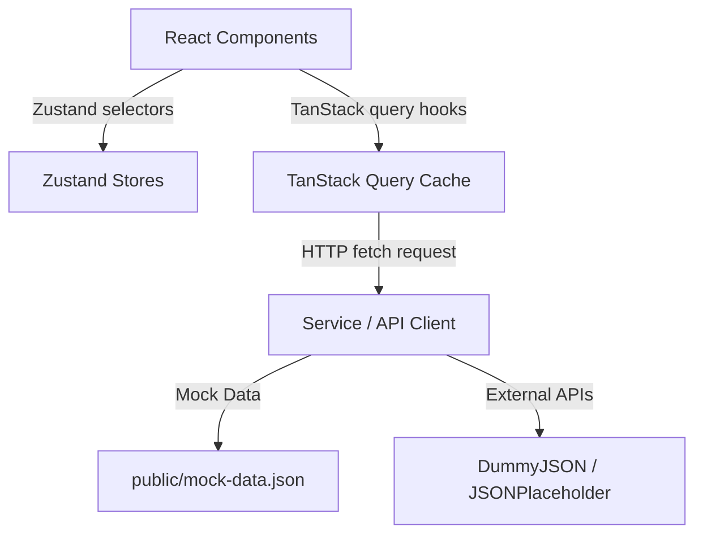

# Architecture Documentation — SprintDesk

SprintDesk is designed as a client-side React single-page application (SPA). All state is maintained on the client, fetching initial mock datasets and syncing with public endpoints.

## Architecture Overview

The system divides state into three distinct layers to ensure optimal rendering performance and separation of concerns:
1. **Server State (TanStack Query)**: Manages remote cached endpoints (sprint tasks, comments, and users) with automatic query invalidations and updates.
2. **Application State (Zustand)**: Manages global, client-persisted configurations (active user sessions, task board client edits, incoming notifications list, and light/dark theme toggle).
3. **Local State (React useState)**: Handles local component values (open modal toggles, dropdown active state, and details drawer selection).

## Data Flow

- **Server State**: React Components -> TanStack Query hooks -> Service/Data-access layer -> Mock API fetch.
- **Application State**: React Components -> Zustand store -> LocalStorage persistence.

## Core Flows

### 1. Authentication Flow
- **Login Request**: Login page submits username/password to `DummyJSON` login endpoint. On success, the access token is stored in memory, and the refresh token is stored in local storage.
- **Refresh Interceptor**: API requests contain a bearer authorization header. If an request returns an unauthorized response (token expired), the `apiClient` Axios interceptor catches the error, calls the token refresh endpoint, and retries the original request with the fresh token.
- **Logout**: Clears all in-memory tokens and local storage values, and redirects the user back to the `/login` route.

### 2. Board Data Flow
- **Data Load**: React Query fetches `public/mock-data.json` to load tasks.
- **Zustand Init**: The tasks array is copied into the Zustand `boardStore` to support client-side updates (CRUD operations, same/cross column drag-and-drop, reordering, and local persistence).
- **Sub-Component Memoization**: React memo is applied to `TaskCard` and `Column` wrappers to prevent cascading renders when unrelated drawer edits occur.

### 3. Notifications Polling Flow
- **Periodic Polling**: Polling query checks the JSONPlaceholder `/posts?_limit=5` endpoint every 10 seconds.
- **Tab Visibility Listeners**: Checks the document's `visibilityState` properties on window changes, pausing query fetches when tabs are hidden and resuming them when active.
- **Closed-panel Toasts**: Dispatches design-system toast feedback elements only if the notification bell dropdown list panel is currently closed.

### 4. Analytics Data Flow
- **Derived Computations**: Calculations (Sprint Velocity, Task Status, Priority Breakdown, and Completion Trend) are computed dynamically from board store tasks arrays using `useMemo` hooks to avoid expensive array loops on unrelated renders.

### 5. Theme Selector Flow
- **Theme store**: Saves active selector states (`'light' | 'dark'`) persisted under storage key `'theme-store'`.
- **Root Sync**: Inside `App.tsx`, a side-effect hook attaches or removes the `'dark'` class from the root `html` tag to apply responsive Tailwind color palettes.

## Folder Responsibilities

- `src/components`: Reusable layout components and Tailwind-styled design-system elements.
- `src/pages`: Top-level route screen views loaded via React.lazy splitting.
- `src/hooks`: Global custom data-fetching hooks and polling triggers.
- `src/services`: Service layer for HTTP network request setups.
- `src/stores`: Zustand state stores for client persistence.
- `src/types`: Strict TypeScript model definitions.
- `src/test`: Unit and integration test suites.
